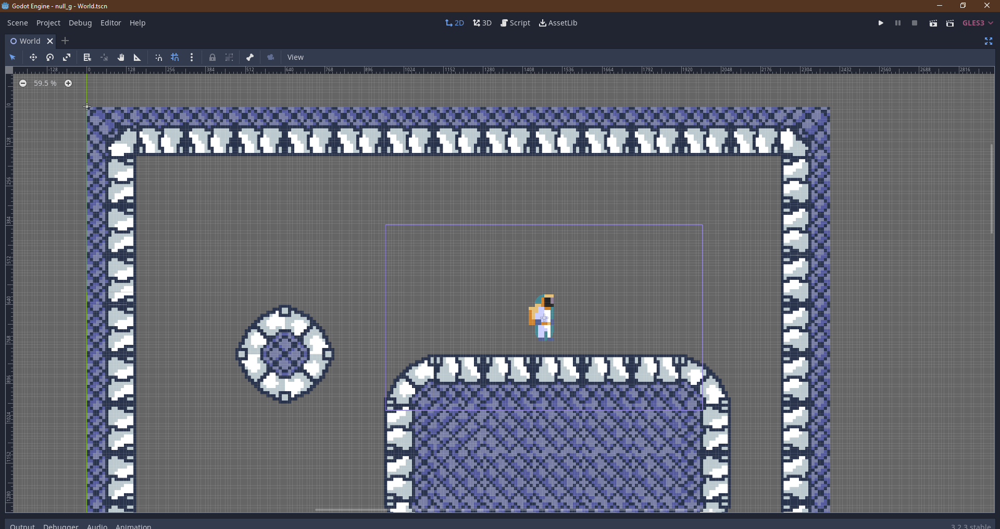

# null_g

Zero gravity game made in Godot

Use momentum and trajectories to traverse the environment

## Controls
W - move up
A - move right
S - move down
D - move right
SPACE - jump

## Notes
* Hold and release space to jump harder
* No movement allowed when the player leaves a surface
* The player will not leave the surface until they jump
* Movement key is relative to starting position, until the key is released
